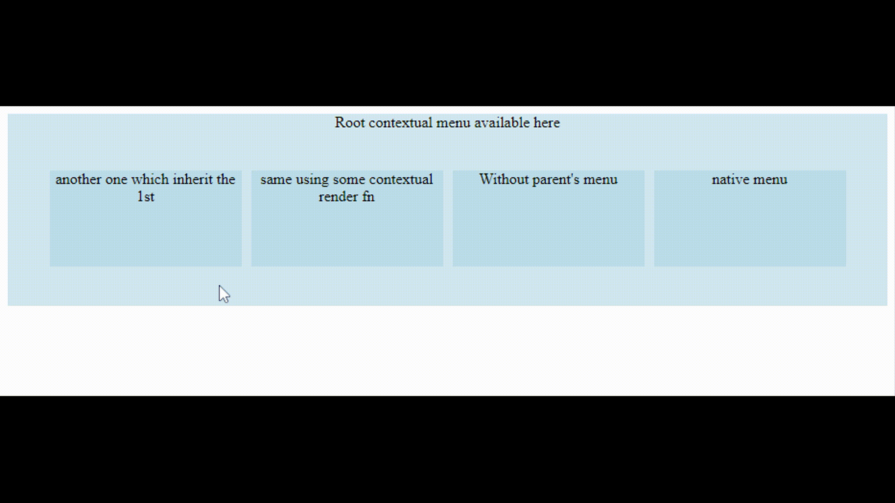

<h1 align="center">react-inheritable-contextmenu</h1>

<p align="center"></p>

<a href="https://www.npmjs.com/package/react-inheritable-contextmenu">
</a>

Simple Context menu component for react showing all inherited parents menu in theirs contexts with SSR compa.

Sample [here](http://htmlpreview.github.io/?https://github.com/n8tz/react-inheritable-contextmenu/blob/master/samples/index.html)

```
 npm i react-inheritable-contextmenu -s
```

## Why another context menu ?

Because none of the existing ones have met my requirements :
 - Ability to inherit & include parents context menus
 - Possibility to render menu items basing the browser event
 - Simple to use
 - Simple to animate with css
 - Do not break SSR

## Usage

```jsx

import {ContextMenu} from "react-inheritable-contextmenu";

// override default rendered comps
// * there is no css builtin, but there is classNames .inContextMenuLayer > .inContextMenu
ContextMenu.DefaultMenuComp = Paper
ContextMenu.DefaultSubMenuComp = 'div'

// add optional cool anims ( choose & add in css any anims in http://animista.net/ )
ContextMenu.DefaultShowAnim = 'slide-in-blurred-left';
ContextMenu.DefaultHideAnim = 'slide-out-blurred-right';

// set show/hide anims duration (default to 250)
ContextMenu.DefaultAnimDuration = 200;

//...

render(){
    return <div className={ "root" }>
        <ContextMenu>
            <div>Menu root</div>
        </ContextMenu>
        Root contextual menu available here
        <br/>
        <br/>
        <br/>
        <div className={ "block" }>
            another one which inherit the 1st<br/>
            <ContextMenu>
                <div>Menu 2</div>
            </ContextMenu>
        </div>

        <div className={ "block" }>
            same using some contextual render fn<br/>
            <ContextMenu  // show Menu root & menu 2
                renderMenu={
                    ( e, allMenuComps ) => <div>Menu 2 <i>x:{ e.x } x:{ e.y }</i></div>
                }/>
        </div>
        <div className={ "block" }>
            Without parent's menu<br/>
            <ContextMenu
                root         // don't show parent's menu
                renderMenu={
                    ( e, allMenuComps ) => <div>Menu <i>x:{ e.x } x:{ e.y }</i></div>
                }/>
        </div>
        <div className={ "block" }>
            native menu<br/>
            <ContextMenu
                native         // use natve menu
            />
        </div>
        <br/>
        <br/>
        <br/>
    </div>;
}

//...


```

### License ?

MIT license

