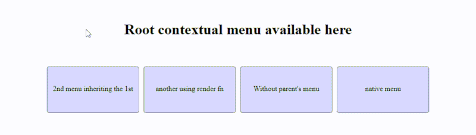

<h1 align="center">react-inheritable-contextmenu<h1>

<a href="https://www.npmjs.com/package/react-inheritable-contextmenu">
</a>

<p align="center" style="font-size:25px"><b>

Simple Context menu component for react showing all inherited parents menu in theirs contexts.

Sample [here](http://htmlpreview.github.io/?https://github.com/n8tz/react-inheritable-contextmenu/blob/master/samples/index.html)

```
 npm i react-inheritable-contextmenu -s
```

# Usage

```es6

import {ContextMenu} from "react-inheritable-contextmenu";

// override default rendered comps
ContextMenu.DefaultMenuComp = Paper
ContextMenu.DefaultSubMenuComp = 'ul'

//...

render(){
    return <div>
               <ContextMenu>
                   <li>Menu root</li>
               </ContextMenu>
               a word<br/>
               <div>
                   another word<br/>
                   <ContextMenu>  // show Menu root & menu 2
                       <li>Menu 2</li>
                   </ContextMenu>
               </div>

               <div>
                   another word<br/>
                   <ContextMenu  // show Menu root & menu 2
                      renderMenu={
                         (e, allMenuComps) => <li>Menu 2</li>
                      }/>
               </div>

               <div>
                   root word<br/>
                   <ContextMenu
                      root         // don't show parent's menu
                      renderMenu={
                         (e, allMenuComps) => <li>Menu 2</li>
                      }/>
               </div>
               <div>
                   root word<br/>
                   <ContextMenu
                      native         // use natve menu
                      />
               </div>
           </div>;
}

//...


```

### License ?

MIT license

